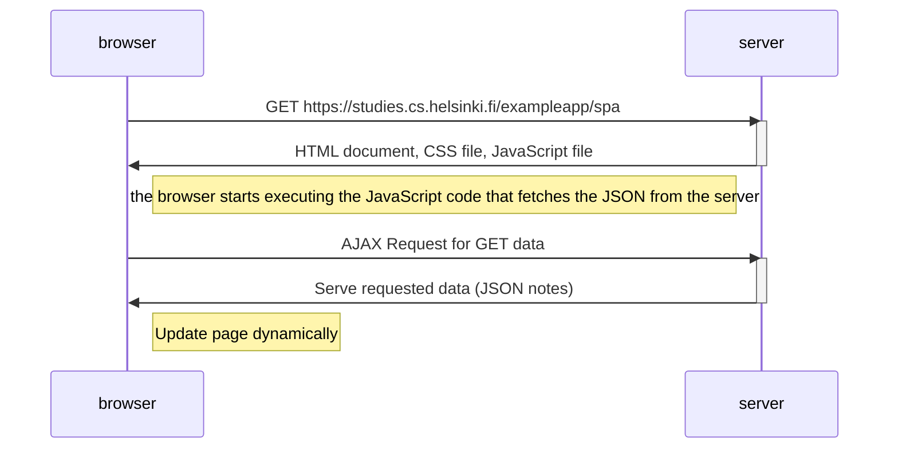

```mermaid
sequenceDiagram
  participant browser
  participant server

  browser->>server: GET https://studies.cs.helsinki.fi/exampleapp/spa
  activate server
  server->>browser: HTML document, CSS file, JavaScript file
  deactivate server

  Note right of browser: the browser starts executing the JavaScript code that fetches the JSON from the server

  browser->>server: AJAX Request for GET data
  activate server
  server->>browser: Serve requested data (JSON notes)
  deactivate server

  Note right of browser: Update page dynamically 
```