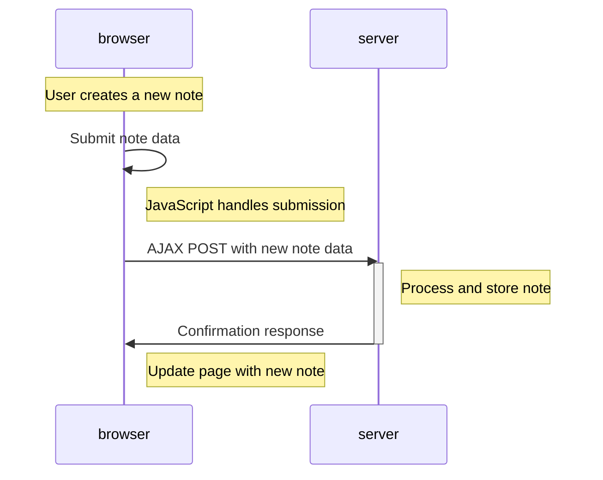

```mermaid
sequenceDiagram
  participant browser
  participant server

    Note over browser: User creates a new note
    browser->>browser: Submit note data

    Note right of browser: JavaScript handles submission
    browser->>server: AJAX POST with new note data
    activate server
    Note right of server: Process and store note
    server->>browser: Confirmation response
    deactivate server

    Note right of browser: Update page with new note
```